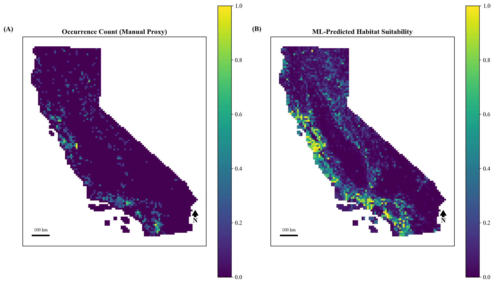
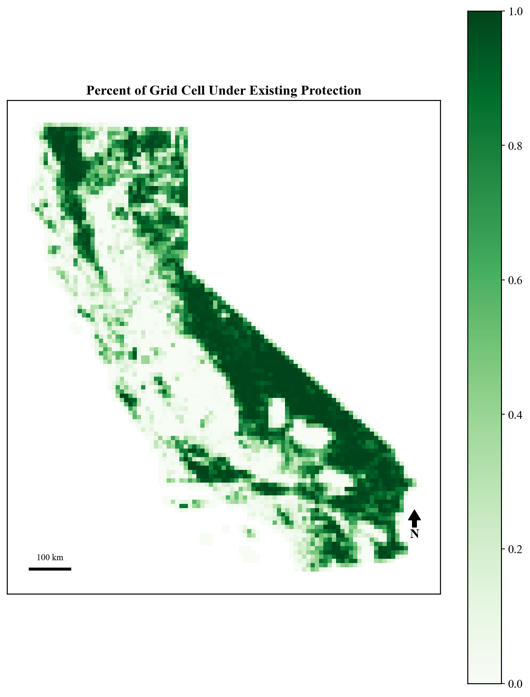
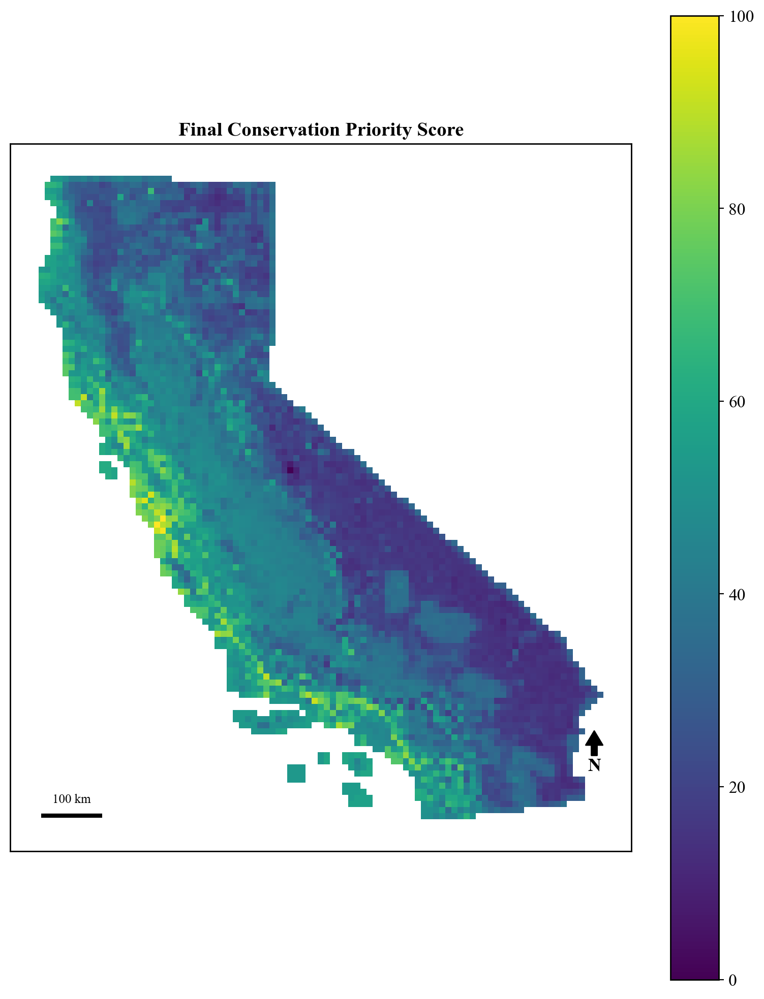
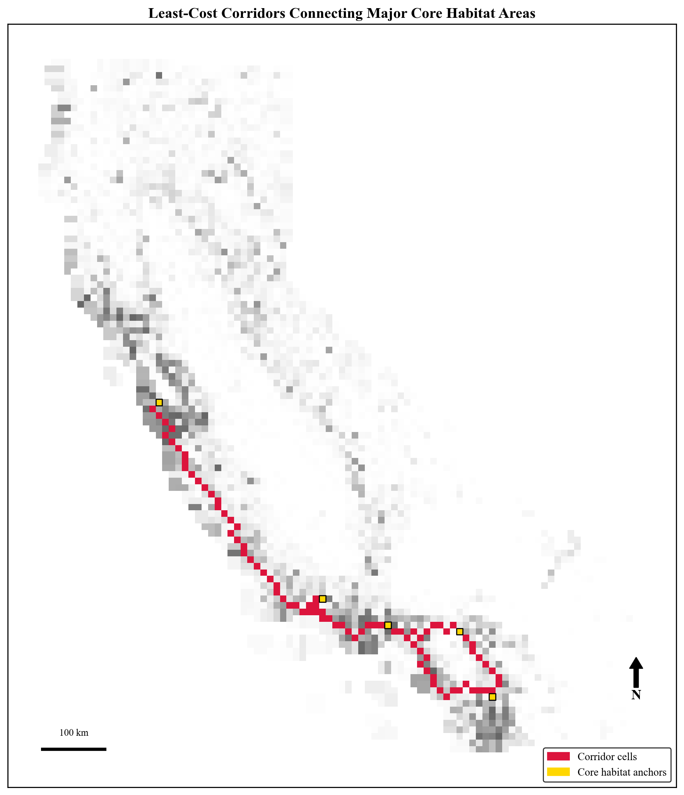
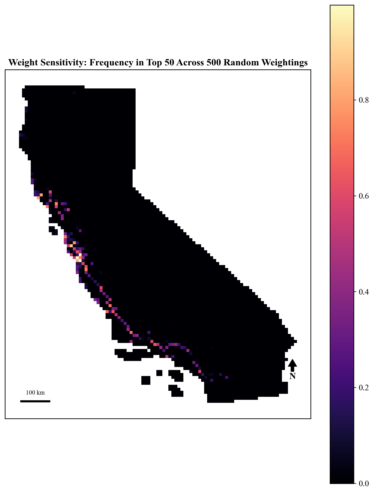

# Climate-Resilient Conservation Prioritization Using GIS and Machine Learning

**A reproducible, transferable framework for optimizing conservation land acquisition under budget constraints — demonstrated using mountain lion (*Puma concolor*) habitat in California.**

AJ Sager

[](https://www.python.org/)
[](LICENSE)
[]()

---

## Overview

California's capacity to fund conservation land protection is limited relative to the scale of habitat under pressure from development, wildfire, and climate change. This project builds an end-to-end, reproducible pipeline that:

1. Models species habitat suitability from occurrence data using machine learning
2. Scores every 10km × 10km cell in California on habitat value, wildfire risk, protection gaps, climate resilience, and corridor connectivity
3. Solves a budget-constrained optimization to select the parcel set that maximizes conservation value per dollar spent

**This is a methodological framework, not a species-specific study.** Every input layer — species occurrence, wildfire history, protection status, climate — is swappable. The same pipeline could be re-run for black bear or spotted owl habitat, wildfire-adjacent restoration planning, or carbon-focused land acquisition, without altering the underlying methodology (see [Generalizability](#generalizability)).

📄 **Full write-up:** [`report/Conservation_Prioritization_Paper.docx`](report/Conservation_Prioritization_Paper.docx)
📓 **Full analysis:** [`notebooks/conservation_prioritization.ipynb`](notebooks/conservation_prioritization.ipynb)

---

## Key Results

| Metric | Result |
|---|---|
| Species distribution model performance | Random Forest, AUC = 0.945 (random split) → **0.841 under spatial block cross-validation** |
| Model comparison | Random Forest (0.945) and XGBoost (0.944) both clearly outperformed Logistic Regression (0.635) |
| Optimized vs. naive budget allocation | **80.5% higher** total conservation value at an equivalent $2.46B budget (200 cells vs. 56) |
| Corridor land captured by optimization | **11.5%** of selected land, vs. ~2% of all land statewide — a ~6× overrepresentation with no explicit corridor constraint |
| Weight sensitivity | 4 of the top 50 priority cells were robust across ≥90% of 500 randomly reweighted simulations |
| External validation (vs. CDFW ACE dataset) | 78.5% of top-10% priority cells fell in ACE's top biodiversity tier, vs. a 37.2% baseline (>2× expected rate) |

---

## Figures

**Figure 1 — Manual occurrence proxy vs. ML-predicted habitat suitability** (Spearman's ρ = 0.406)
Citizen-science sightings alone (A) cluster near accessible, populated areas. The Random Forest model (B) instead reveals continuous high-suitability habitat tracing the Sierra Nevada and coastal mountain ranges — evidence that ML modeling recovers ecologically coherent habitat that raw observation data misses.



**Figure 2 — Existing protection status**
Percent of each grid cell under existing protection (CPAD Holdings). Heavy protection follows the Sierra Nevada spine and northern coastal ranges; the Central Valley agricultural corridor is largely unprotected.



**Figure 3 — Final connectivity-aware conservation priority score**
Combines habitat suitability, wildfire risk, protection status, climate resilience, and corridor importance into a single 0–100 score per grid cell.



**Figure 4 — Least-cost corridors connecting core habitat areas**
Corridors (red) connecting the five largest core habitat clusters (gold anchors), computed via Dijkstra's algorithm over a habitat-suitability-derived resistance surface. 47.7% of the 88 identified corridor cells have less than 30% existing protection.



**Figure 5 — Weight sensitivity analysis**
Per-cell frequency of appearing in the top 50 priority cells across 500 randomly reweighted simulations — identifying priorities that are robust to subjective weight choice rather than artifacts of one particular formula.



---

## Budget-Constrained Optimization

A binary integer program (PuLP, CBC solver) selects the subset of grid cells maximizing total priority score under a fixed budget. An initial formulation without a meaningful per-parcel fixed cost produced a **degenerate solution** favoring 1,254 trivially cheap, already-protected cells; adding a $2M fixed transaction cost per cell and excluding cells with ≥90% existing protection resolved this.

| Strategy | Cells Selected | Total Cost | Total Priority Score | Avg. Score / Cell |
|---|---|---|---|---|
| Naive (top-ranked first) | 56 | $2,462,696,143 | 4,811 | 85.9 |
| **Optimized (knapsack, final)** | **200** | **$2,464,641,829** | **8,686** | 43.4 |

The naive strategy scores higher *per cell*, but the optimized strategy delivers far greater *aggregate* conservation value by spreading the same budget across more moderately priced, still high-value parcels rather than a handful of premium ones.

### No-regret priorities across budget scenarios

Re-solving the optimization at four budget levels (−10%, base, +10%, +25%) showed selections were fully nested — no cell selected at a lower budget was ever dropped at a higher one. 184 of 200 base-selection cells (92%) were selected across **all four** budget levels, representing "no-regret" priorities whose value doesn't depend on the exact budget available. These were geographically widespread (45 counties), concentrated most heavily in San Diego (21 cells), San Bernardino (12), Ventura (10), and Riverside (10) — while the single highest-scoring individual cells clustered tightly along the Central Coast.

---

## Methodology

| Stage | Approach |
|---|---|
| **Spatial framework** | 10km × 10km grid over California, EPSG:3310, 4,498 cells |
| **Species occurrence** | GBIF (`pygbif`), 2,349 filtered human observations (<5km coordinate uncertainty) |
| **Habitat suitability** | Random Forest classifier (200 trees), 4 climate/elevation predictors, evaluated via both random split and **spatial block cross-validation** (205 ~50km blocks) to correct for spatial autocorrelation inflation |
| **Model comparison** | Random Forest vs. XGBoost vs. Logistic Regression on an identical train/test split |
| **Confounding diagnostic** | A distance-to-road predictor showed a negative correlation with suitability (Spearman's ρ = −0.257) — consistent with observation-effort bias, not genuine road avoidance — and was excluded from the final model |
| **Future climate** | WorldClim 2.1 CMIP6, MPI-ESM1-2-HR model, SSP2-4.5 scenario, 2061–2080 |
| **Wildfire risk** | CAL FIRE FRAP perimeters (2000–2025), log-transformed cumulative burned acreage |
| **Protection status** | CPAD Holdings — true overlap area between each cell and protected-area geometries |
| **Connectivity** | Least-cost path analysis (Dijkstra's algorithm) between the 5 largest core habitat clusters, over a habitat-suitability-derived resistance surface |
| **Priority score** | `0.30·Suitability + 0.15·Corridor − 0.20·Fire Risk − 0.15·Protection + 0.20·Climate Resilience` (all inputs min-max scaled) |
| **Weight sensitivity** | 500 Dirichlet-sampled alternative weightings, re-ranking top 50 cells each time |
| **Optimization** | Budget-constrained knapsack (PuLP/CBC), $2.46B budget (~2% of estimated $123.2B statewide conservation need) |
| **External validation** | CDFW Areas of Conservation Emphasis (ACE) v3.2.4 — independently built biodiversity and connectivity rankings |

Full methodological detail, all equations, and complete results (including the multi-objective portfolio comparison and county-level breakdowns) are in the [paper](report/Conservation_Prioritization_Paper.docx).

---

## Generalizability

The framework's components fall into two categories — reusable across species/regions vs. requiring domain-specific customization:

| Module | Generalizable? | Requires Species-Specific Customization? |
|---|---|---|
| Occurrence data | No | Yes |
| Environmental predictor selection | No | Yes |
| Feature engineering | Partial | Often |
| Species distribution model | Yes | Hyperparameters only |
| Connectivity analysis | Yes | Resistance surface values |
| Multi-criteria prioritization / optimization | Yes | Objective weights |
| Sensitivity analysis | Yes | No |
| External validation | Yes | Reference dataset choice |

---

## Repository Structure

```
├── notebooks/
│   └── conservation_prioritization.ipynb   # full, reproducible analysis pipeline
├── report/
│   └── Conservation_Prioritization_Paper.docx   # full write-up with methods, results, discussion
├── figures/
│   └── fig1-6*.png                         # journal-style final figures
├── data/                                   # not included — see Data Sources below
├── requirements.txt
└── README.md
```

> Raw data (GBIF downloads, WorldClim rasters, CAL FIRE FRAP geodatabase, CPAD shapefile) is not included in this repository due to file size. Download links, filters, and exact parameters used are documented in the notebook and paper.

---

## Setup

This project requires a geospatial Python stack (geopandas, rasterio, fiona) that is prone to GDAL library conflicts when pip-installed into an existing Anaconda base environment. A clean conda-forge environment is strongly recommended:

```bash
conda create -n geo python=3.11 geopandas rasterio pygbif scikit-learn xgboost scipy pulp networkx matplotlib jupyter -c conda-forge -y
conda activate geo
python -m ipykernel install --user --name geo --display-name "Python (geo)"
```

Then select the **"Python (geo)"** kernel in Jupyter before running the notebook.

Alternatively, install via pip (see [`requirements.txt`](requirements.txt)), though this is more likely to hit library conflicts on raster operations:

```bash
pip install -r requirements.txt
```

> **Known issue:** `rasterstats` caused a persistent kernel crash due to a GDAL library conflict in this environment. It has been deliberately excluded and replaced with plain `rasterio` centroid sampling + `scipy` nearest-neighbor fill for coastal nodata cells. Do not reintroduce `rasterstats`.

---

## Data Sources

| Input | Source | Access |
|---|---|---|
| Species occurrence | [GBIF](https://www.gbif.org/) | `pygbif` API |
| County/state boundaries | US Census TIGER/Line | [census.gov](https://www.census.gov/geographies/mapping-files/time-series/geo/tiger-line-file.html) |
| Wildfire history | CAL FIRE FRAP | [frap.fire.ca.gov](https://frap.fire.ca.gov/mapping/gis-data/) |
| Protected areas | California Protected Areas Database (CPAD) | [calands.org/cpad-gis](https://www.calands.org/cpad-gis) |
| Historical climate | WorldClim 2.1 | [worldclim.org](https://worldclim.org/data/worldclim21.html) |
| Future climate projections | WorldClim 2.1 (CMIP6, MPI-ESM1-2-HR, SSP2-4.5) | [worldclim.org](https://worldclim.org/data/cmip6/cmip6climate.html) |
| External validation | CDFW Areas of Conservation Emphasis (ACE) v3.2.4 | [wildlife.ca.gov](https://wildlife.ca.gov/Data/Analysis/ACE) |

---

## Limitations

- Species occurrence data is presence-only and subject to observation-effort bias (citizen-science sightings cluster near accessible areas)
- Priority score weights were assigned subjectively rather than empirically calibrated (partially addressed via sensitivity analysis)
- Only one climate model and emissions scenario (of 23 models / 4 scenarios available) were evaluated
- Acquisition costs use simplified flat-rate assumptions rather than real estate valuation data
- Connectivity analysis uses only the 5 largest of 77 core habitat clusters as anchors and does not incorporate physical barriers (highways, urban development) into the resistance surface
- Single-species focus — a true multi-species biodiversity prioritization would require additional occurrence datasets

Full discussion, including how these limitations interact and compound, is in [Section 5 of the paper](report/Conservation_Prioritization_Paper.docx).

---

## Planned Next Steps

- Target-group background sampling to reduce observation-effort bias in the SDM
- Land cover / vegetation data to strengthen habitat suitability beyond climate/elevation
- Multi-species or general-purpose connectivity formulation, directly comparable to ACE's terrestrial layer
- Multi-species analysis using additional umbrella/indicator species
- Real land valuation data in place of flat cost assumptions
- Interactive dashboard for real-time weight/budget adjustment by stakeholders

---

## Reproducibility

- Python 3.11, fixed random seed (`random_state = 42`) for train/test splitting, model fitting, background point generation, and the Dirichlet-based sensitivity analysis
- Developed on macOS / Anaconda; see [Setup](#setup) for the recommended conda-forge environment to avoid GDAL conflicts

## Citation

If you use this framework or build on it, please cite:

```
Sager, AJ (2026). Climate-Resilient Conservation Prioritization Using GIS and Machine Learning:
Optimizing Conservation Investments Under Climate Change. 
```

## Author

**A.J. Sager** — University of California, Irvine
Data science · GIS · conservation biology
